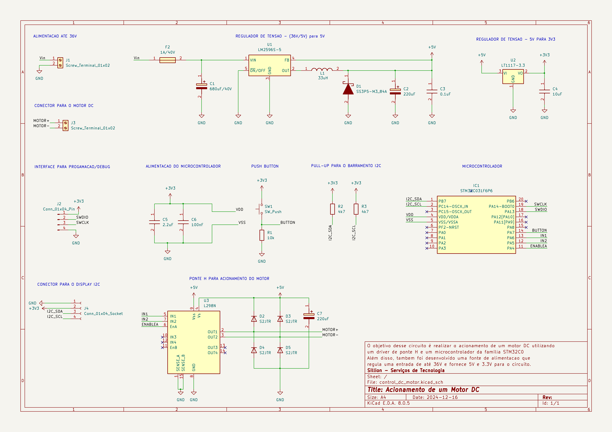
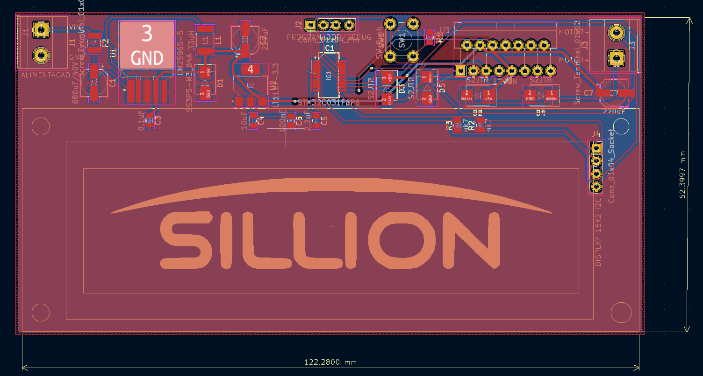
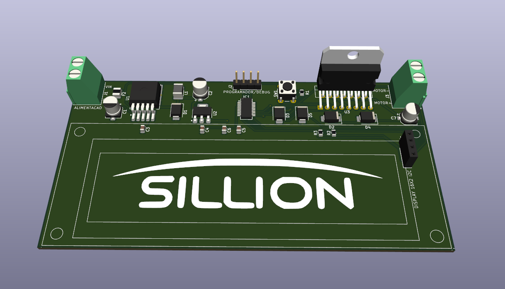
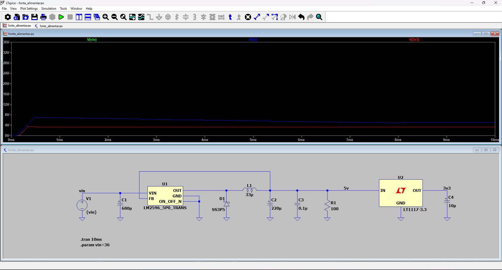

# stm32-sillion-acionate-dc-motor
Esse repositório contém o firmware necessário para o acionamento de um motor DC utilizando o microcontrolador STM32C031F6P6 e o driver de Ponte H L298N

## Requisitos

1. Controle de um motor DC de 5V utilizando o driver L298N.
2. Exibição de status no display LCD 16x2 via comunicação I2C.
3. Acionamento do motor por meio de um push-button.
4. O motor deve permanecer ligado por 10 segundos após o acionamento.
5. A placa será alimentada por uma fonte DC de 5V (ou até 36V com regulador).
6. Código em C para controlar o motor e exibir o status no display.

## Dependências

- Microcontrolador: STM32C031F6P6
- IDE: STM32CubeIDE
- STM32 HAL Library

## Esquemático

## PCB

## Simulação da fonte de alimentação

